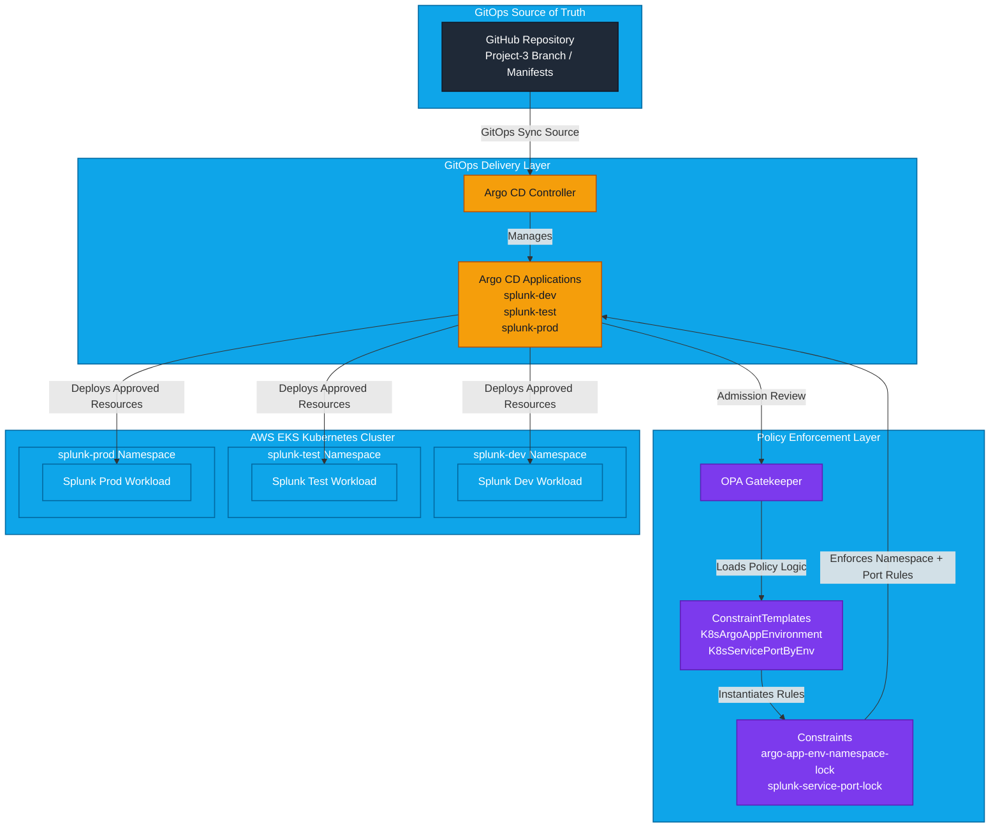

# 📽 **Project 3 – OPA Gatekeeper + Argo CD (Kubernetes Policy Enforcement)**


---

## 🧪 **Lab Overview**

This project demonstrates **OPA Gatekeeper (Kubernetes Policy Enforcement) integrated with a GitOps workflow using Argo CD.** The lab simulates a **secure multi-environment platform** where applications are deployed through GitOps while **admission policies enforce strict environment rules.**

### 💡 **Key goals**

* Prevent misconfigured deployments
* Enforce environment isolation
* Validate service exposure rules
* Demonstrate **DevSecOps runtime policy enforcement**

The system deploys a **Splunk application across three environments**:

| **Environment** | **Namespace** |
| --------------- | ------------- |
| **Production**  | `splunk-prod` |
| **Testing**     | `splunk-test` |
| **Development** | `splunk-dev`  |

---

## 🔐 **Security Policies Enforced**

Gatekeeper enforces the following policies:

### 1️⃣ Argo CD Environment Namespace Lock

Each Argo CD Application must deploy only to its correct namespace.

| **App**         | **Allowed Namespace** |
| --------------- | --------------------- |
| **splunk-prod** | **splunk-prod**       |
| **splunk-test** | **splunk-test**       |
| **splunk-dev**  | **splunk-dev**        |

Example violation:

```text
DENY: ArgoCD Application env=prod must deploy only to namespace splunk-prod
```

---

### 2️⃣ Splunk Service Port Enforcement

Each namespace requires a **specific service port**.

| **Namespace**   | **Required Port** |
| --------------- | ----------------- |
| **splunk-prod** | **8091**          |
| **splunk-test** | **18091**         |
| **splunk-dev**  | **28091**         |

Example violation:

```text
DENY: Service splunk in namespace splunk-prod must expose port 8091
```

---

## 🧠 **DevSecOps Skills Demonstrated**

This lab demonstrates real enterprise platform skills:

| **Category**                | **Skills**               |
| --------------------------- | ------------------------ |
| **Infrastructure as Code**  | `Terraform`              |
| **Cloud Platform**          | `AWS EKS`                |
| **Container Orchestration** | `Kubernetes`             |
| **GitOps**                  | `Argo CD`                |
| **Security**                | `OPA Gatekeeper`         |
| **Policy as Code**          | `Rego`                   |
| **Runtime Security**        | `Admission Controllers`  |
| **Automation**              | `Bash`                   |
| **Validation**              | `Automated test scripts` |

---

## 🏗 **Architecture Overview**



---

## 🎤 **Interview Talk Track**

### 1️⃣ **Business Explanation**

Organizations must ensure **deployment security and governance** in modern cloud environments.

This project demonstrates how **GitOps deployment pipelines can be secured using runtime policy enforcement**.

Benefits include:

* Secure environment isolation
* Automatic policy validation
* Prevent misconfigurations
* Enforce compliance
* Improve deployment safety

This approach reflects **modern enterprise Kubernetes platform security practices.**

---

### 2️⃣ 🛠 **DevOps / Technical Explanation**

This environment integrates:

* **Terraform** provisioning AWS infrastructure
* **Kubernetes** for orchestration
* **Argo CD** for GitOps deployment
* **OPA Gatekeeper** enforcing admission control policies
* **Rego** for defining policies as code
* **Bash** for automation
* **Automated tests** for validation

Policies are defined as **ConstraintTemplates using Rego** and enforced at runtime through the Kubernetes API server admission chain.

This ensures that **any invalid deployment is rejected before it reaches the cluster.**

---

## 📁 **Project Structure**

```text
project-3/
├── homework/
│   ├── 00-namespaces.yaml
│   ├── 10-template-argo-app-env-namespace.yaml
│   ├── 11-constraint-argo-app-env-namespace.yaml
│   ├── 20-template-splunk-service-port-by-env.yaml
│   ├── 21-constraint-splunk-service-port-by-env.yaml
│   ├── 30-app-splunk-prod.yaml
│   ├── 31-app-splunk-dev.yaml
│   ├── 32-app-splunk-test.yaml
│   ├── 40-cheat-prod-to-dev.yaml
│   └── 41-cheat-prod-service-wrong-port.yaml
│
├── homework-results/
│   ├── outputs.txt
│   └── resources.json
│
├── manifests/
│   └── splunk/
│       ├── base/
│       │   ├── deployment.yaml
│       │   ├── kustomization.yaml
│       │   └── service.yaml
│       └── overlays/
│           ├── dev/
│           │   ├── deployment.yaml
│           │   └── kustomization.yaml
│           ├── prod/
│           │   ├── deployment.yaml
│           │   └── kustomization.yaml
│           └── test/
│               ├── deployment.yaml
│               └── kustomization.yaml
│
├── Screenshots/
|   ├── apply-policies-pt1.jpg
|   ├── apply-policies-pt2.jpg
|   ├── argocd-apps-list.jpg
|   ├── argocd-apps-sync.jpg
|   ├── build-infra-pt1.jpg
|   ├── build-infra-pt2.jpg
|   ├── build-infra-pt3.jpg
|   ├── build-infra-pt4.jpg
|   ├── build-infra-pt5.jpg
|   ├── collect-homework-pt1.jpg
|   ├── collect-homework-pt2.jpg
|   ├── deploy-apps.jpg
|   ├── install-gatekeeper.jpg
|   ├── prerequisites-script.jpg
|   ├── run-tests.jpg
|   ├── splunk-dev-tree.jpg
|   ├── splunk-prod-tree.jpg
|   ├── splunk-test-tree.jpg
|   ├── teardown-pt1.jpg
|   ├── teardown-pt2.jpg
|   ├── teardown-pt3.jpg
|   └── teardown-pt4.jpg
|
├── scripts/
│   ├── 0-prerequisites.sh
│   ├── 1-build-infrastructure.sh
│   ├── 2-install-gatekeeper.sh
│   ├── 3-apply-policies.sh
│   ├── 4-deploy-apps.sh
│   ├── 5-run-tests.sh
│   ├── 6-collect-homework.sh
│   └── 7-teardown.sh
│
├── .gitignore
├── 0-var.tf
├── 1-auth.tf
├── 2-vpc.tf
├── 3-subnets.tf
├── 4-igw.tf
├── 5-nat.tf
├── 6-rtb.tf
├── 7-eks.tf
├── 8-node.tf
├── 9-runtime.tf
├── 10-iam-oidc.tf
├── 11a-storage-iam.tf
├── 11b-storage-helm.tf
├── 12-outputs.tf
└── README.md
```

---

## 🧾 **Automation Scripts**

> !NOTE
> The lab is fully automated using Bash scripts.

---

### 0️⃣ **Preflight Checks**

```bash
./scripts/0-prerequisites.sh
```


Validates:

* required CLI tools
* AWS authentication
* Terraform files
* Kubernetes access

---

### 1️⃣ **Build Infrastructure**

```bash
./scripts/1-build-infrastructure.sh
```


Creates:

* VPC
* EKS cluster
* node groups
* IAM roles

---

### 2️⃣ **Install Gatekeeper**

```bash
./scripts/2-install-gatekeeper.sh
```


Installs:

* Gatekeeper controller
* audit pods
* admission webhooks

---

### 3️⃣ **Apply Security Policies**

```bash
./scripts/3-apply-policies.sh
```


Deploys:

* namespaces
* constraint templates
* policy constraints

---

### 4️⃣ **Deploy Applications**

#### **Creates Argo CD namespace and installs Argo CD controller before validating prerequisites.**

```bash
kubectl create namespace argocd

kubectl apply -n argocd \
  --server-side \
  --force-conflicts \
  -f https://raw.githubusercontent.com/argoproj/argo-cd/stable/manifests/install.yaml
```


#### **Run Deployment Script**

```bash
./scripts/4-deploy-apps.sh
```


Deploys Splunk apps through **Argo CD GitOps**.

---

### 5️⃣ **Run Security Tests**

```bash
./scripts/5-run-tests.sh
```


Runs negative tests to ensure policies block invalid deployments.

---

### 6️⃣ **Collect Evidence**

```bash
./scripts/6-collect-homework.sh
```


Generates:

* [**Lab Verification Output**](/homework-results/outputs.txt)
* [**Cluster Resource Inventory**](/homework-results/resources.json)

---

### 7️⃣ **Teardown**

```bash
./scripts/7-teardown.sh
```

Removes:

* Argo CD apps
* Gatekeeper policies
* namespaces
* cluster resources

Then destroy infrastructure:

```bash
terraform destroy
```


---

## 🖼️ **Demo and Artifacts**

### 📦 **Argo CD Deployment Demo**

  <https://github.com/user-attachments/assets/d78d39d5-a6e8-4c16-ac43-8b3c0747ca07>

### 🖥️ **Splunk Apps Synchronized**

* 
* 

---

### 🌳 **Application Trees**

* **splunk-dev**
  

* **splunk-prod**
  

* **splunk-test**
  

---

## 🧪 **Security Validation**

Two attack scenarios are tested.

### 1️⃣ **Test 1 – Namespace Violation**

Attempt to deploy prod app to dev namespace.


Result:

```text
DENY: ArgoCD Application env=prod must deploy only to namespace splunk-prod
```

---

### 2️⃣ **Test 2 – Invalid Service Port**

Attempt to expose incorrect port.


Result:

```text
DENY: Service splunk in namespace splunk-prod must expose port 8091
```

---

## 🧰 **Troubleshooting**

### 1️⃣ **Gatekeeper ConstraintTemplate Error**

Error:

```text
invalid ConstraintTemplate
```

Fix:

```bash
kubectl delete constrainttemplate k8sargoappenvironment
kubectl apply -f template.yaml
kubectl wait --for=condition=Established crd/k8sargoappenvironment.constraints.gatekeeper.sh
```

---

## 2️⃣ **Argo CD Application CRD Missing**

Error:

```text
no matches for kind Application
```

Fix:

```bash
kubectl apply -n argocd -f \
https://raw.githubusercontent.com/argoproj/argo-cd/stable/manifests/install.yaml
```

---

## 3️⃣ **Argo CD Applications Stuck in Unknown**

Cause:

Missing AppProject or incorrect spec.

Fix:

```bash
kubectl -n argocd get applications
argocd app sync splunk-dev splunk-prod splunk-test
```

---

## 📊 **Lab Outcome**

After completing this lab the environment contains:

* AWS EKS cluster
* Argo CD GitOps controller
* OPA Gatekeeper admission controller
* policy enforcement for Kubernetes resources
* automated security validation scripts

This demonstrates **enterprise-grade Kubernetes runtime security.**

---

## 📚 **References**

* [**OPA Gatekeeper**](https://open-policy-agent.github.io/gatekeeper/)
* [**Kubernetes Admission Controllers**](https://kubernetes.io/docs/reference/access-authn-authz/admission-controllers/)
* [**Argo CD**](https://argo-cd.readthedocs.io)
* [**Terraform**](https://developer.hashicorp.com/terraform)
* [**AWS EKS**](https://docs.aws.amazon.com/eks/)

---

## 👥 **Authors**

* **Author:** *T.I.Q.S. DevSecOps*
* **Lab Team Lead:** *John Sweeney*
* [**GitHub Profile**](https://github.com/tiqsclass6)
