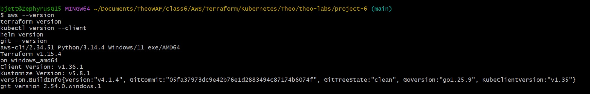
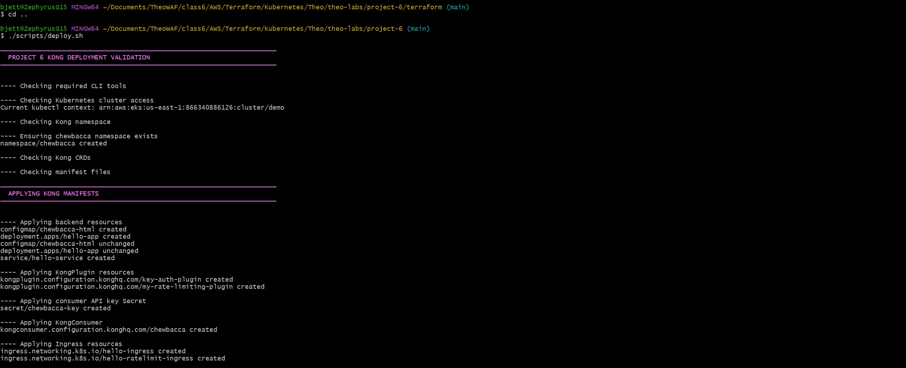
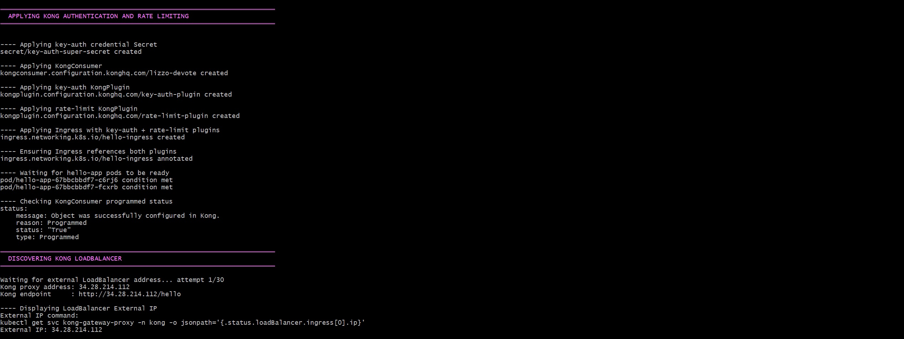
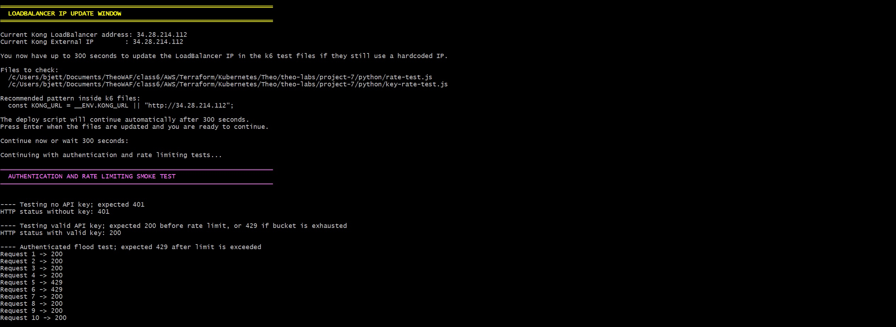
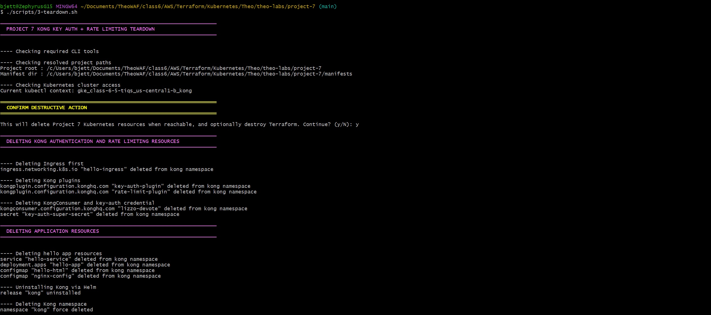
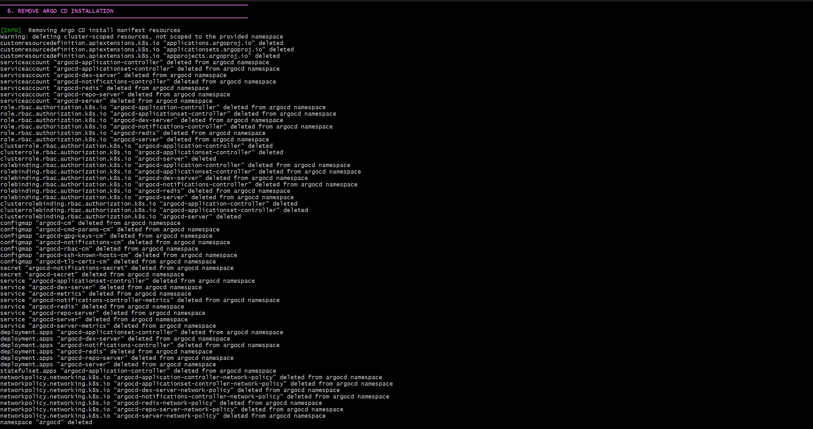

# 🧠 **Project 6 – Kong Ingress + API Key Authentication and Rate Limiting**


---

## 📌 **Table of Contents**

- [📖 **Project Overview**](#-project-overview)
- [🎯 **Project Objectives**](#-project-objectives)
- [✅ **Project Requirements**](#-project-requirements)
- [🏗️ **Network Architecture Summary**](#️-network-architecture-summary)
- [📁 **Project Structure**](#-project-structure)
- [🚀 **Deployment Steps**](#-deployment-steps)
- [🔑 **Manual Testing Commands**](#-manual-testing-commands)
- [✅ **Validation Results**](#-validation-results)
- [📸 **Artifacts and Screenshots**](#-artifacts-and-screenshots)
- [📊 **Useful Commands**](#-useful-commands)
- [🧹 **Teardown and Cost Control**](#-teardown-and-cost-control)
- [🛠️ **Troubleshooting**](#️-troubleshooting)
- [🧠 **Lessons Learned**](#-lessons-learned)
- [📚 **References**](#-references)
- [✍️ **Author**](#️-author)

---

## 📖 **Project Overview**

This project deploys **Kong Ingress Controller** on **Amazon Elastic Kubernetes Service (EKS)** using **Terraform**, **Helm**, and Kubernetes manifests. The lab demonstrates how to expose a sample NGINX application through Kong and secure it using **API key authentication** with the modern Kubernetes-native **Secret + KongConsumer** pattern.

The project also implements **rate limiting** to control repeated requests against a dedicated route. The completed deployment validates:

- Kubernetes ingress routing through Kong
- API key authentication using Kong `key-auth`
- Rate limiting using Kong `rate-limiting`
- AWS LoadBalancer exposure through the Kong proxy service
- Terraform-managed EKS infrastructure
- Repeatable deployment and teardown automation through Bash scripts

---

## 🎯 **Project Objectives**

| **Objective**                       | **Description**                                                                            |
| ----------------------------------- | ------------------------------------------------------------------------------------------ |
| **Provision EKS Infrastructure**    | Use Terraform to build AWS networking, EKS, node group, IAM, OIDC, and platform resources. |
| **Install Kong Ingress Controller** | Use Helm through Terraform to install Kong into the EKS cluster.                           |
| **Deploy a Test Application**       | Deploy an NGINX-based `hello-app` service in Kubernetes.                                   |
| **Expose Application Through Kong** | Route `/hello` and `/hello-ratelimit` through Kong Ingress.                                |
| **Enforce API Key Authentication**  | Protect `/hello` with Kong `key-auth`.                                                     |
| **Enforce Rate Limiting**           | Protect `/hello-ratelimit` with Kong `rate-limiting`.                                      |
| **Validate Access Behavior**        | Confirm expected `401`, `200`, and `429` responses.                                        |
| **Clean Up Safely**                 | Remove Kubernetes resources before manually running `terraform destroy`.                   |

---

## ✅ **Project Requirements**

| **Requirement**        | **Purpose**                                                           |
| ---------------------- | --------------------------------------------------------------------- |
| **AWS Account**        | Hosts EKS, LoadBalancer, VPC, IAM, NAT Gateway, and worker nodes.     |
| **AWS CLI**            | Authenticates to AWS and updates kubeconfig for EKS access.           |
| **Terraform 1.10+**    | Provisions infrastructure as code.                                    |
| **kubectl**            | Applies and validates Kubernetes resources.                           |
| **Helm 3.x**           | Installs Kong Ingress Controller through the Terraform Helm provider. |
| **Git**                | Stores and submits the repository.                                    |
| **Bash / Git Bash**    | Runs `deploy.sh` and `teardown.sh`.                                   |
| **Visual Studio Code** | Edits Terraform, YAML, Bash, and Markdown files.                      |

### Recommended CLI Checks

```bash
# Check versions of required CLI tools
aws --version
terraform version
kubectl version --client
helm version
git --version
```



---

## 🏗️ **Network Architecture Summary**


### Resource Flow

1. Terraform provisions the AWS VPC, subnets, route tables, NAT gateway, EKS cluster, and managed node group.
2. Terraform configures IAM/OIDC support for Kubernetes service accounts.
3. Terraform installs Kong Ingress Controller through Helm.
4. Terraform deploys the sample NGINX application and service.
5. The deployment script applies Kong plugins, consumer, API key secret, and ingress routes.
6. Kong exposes the app through an AWS LoadBalancer service.
7. Validation confirms key-auth and rate-limiting behavior.

---

## 📁 **Project Structure**

```text
project-6/
├── images/
│   ├── deliverables-pt1.jpg
│   ├── deliverables-pt2.jpg
│   ├── deploy-pt1.jpg
│   ├── deploy-pt2.jpg
│   ├── deploy-pt3.jpg
│   ├── teardown-pt1.jpg
│   ├── teardown-pt2.jpg
│   ├── terraform-apply.jpg
│   ├── terraform-destroy-pt1.jpg
│   ├── terraform-destroy-pt2.jpg
│   ├── terraform-init-fmt-validate.jpg
│   ├── terraform-plan.jpg
│   └── version-commands.jpg 
│
├── manifests/
│   ├── apply_key_ingress.yaml
│   ├── apply_ratelimit_ingress.yaml
│   ├── chewbacca_key.yaml
│   ├── chewbacca.yaml
│   ├── kong_plugin_api.yaml
│   └── kong_plugin_ratelimit.yaml
│
├── scripts/
│   ├── deploy.sh
│   └── teardown.sh
│
├── terraform/
│   ├── .gitignore
│   ├── .terraform.lock.hcl
│   ├── 0-var.tf
│   ├── 1-auth.tf
│   ├── 2-vpc.tf
│   ├── 3-subnets.tf
│   ├── 4-igw.tf
│   ├── 5-nat.tf
│   ├── 6-rtb.tf
│   ├── 7-eks.tf
│   ├── 8-node.tf
│   ├── 9-runtime.tf
│   ├── 10-iam-oidc.tf
│   ├── 11a-storage-iam.tf
│   ├── 11b-storage-helm.tf
│   ├── 12-kong.tf
│   └── 13-output.tf
│
└── README.md
```

---

## 🚀 **Deployment Steps**

### **1. Open the Project**

```bash
cd project-6
```

### **2. Provision Infrastructure with Terraform**

```bash
cd terraform
terraform init
terraform fmt
terraform validate
terraform plan
terraform apply
```


### **3. Return to the Project Root**

```bash
cd ..
```

### **4. Deploy and Validate Kong Resources**

```bash
chmod +x scripts/deploy.sh
./scripts/deploy.sh
```





The deployment script:

- Validates cluster access and Kong CRDs
- Applies KongPlugin resources
- Applies the API key Secret
- Applies the KongConsumer
- Applies Ingress routes
- Detects the Kong LoadBalancer endpoint
- Tests authentication and rate limiting

---

## 🔑 **Manual Testing Commands**

### **Get the Kong LoadBalancer hostname:**

```bash
export KONG_HOST=$(kubectl get svc -n kong kong-gateway-proxy \
  -o jsonpath='{.status.loadBalancer.ingress[0].hostname}')

echo "$KONG_HOST"
```

### **Test `/hello` without authentication. Expected result: `401 Unauthorized`.**

```bash
curl -i http://<KONG_HOST>/hello
```

### **Test `/hello` with a valid API key. Expected result: `200 OK`.**

```bash
curl -i http://<KONG_HOST>/hello -H "apikey: super-secret-key"
```

### **Test the rate-limited endpoint. Expected initial result: `200 OK`.**

```bash
curl -i http://<KONG_HOST>/hello-ratelimit
```

### **Trigger the rate limit. Expected result: `429 Too Many Requests` after repeated requests.**

```bash
for i in {1..10}; do
  curl -i http://<KONG_HOST>/hello-ratelimit
done
```

---

## ✅ **Validation Results**

| **Test**                              | **Expected Result**     | **Actual Result**    | **Status** |
| ------------------------------------- | ----------------------- | -------------------- | ---------- |
| `/hello` without API key              | `401 Unauthorized`      | `401`                | ✅ PASS    |
| `/hello` with valid API key           | `200 OK`                | `200`                | ✅ PASS    |
| `/hello-ratelimit` initial request    | `200 OK`                | `200`                | ✅ PASS    |
| Rate limiting after repeated requests | `429 Too Many Requests` | `429` on 5th request | ✅ PASS    |

### Example Kong Endpoint

```text
http://aa5e03fe7d1034f9eb4d2347703964f2-1968007985.us-east-1.elb.amazonaws.com
```

---

## 📸 **Artifacts and Screenshots**

> Replace placeholder screenshot paths with actual screenshots before final submission.

| **Artifact**         | **Description**                                      | **Screenshot**                                     |
| -------------------- | ---------------------------------------------------- | -------------------------------------------------- |
| **401/200**          | `/hello` request **without and with** valid API key. |  |
| **Kong External IP** | `/hello` request with valid API key.                 |  |

---

## 📊 **Useful Commands**

```bash
# View Kong resources
kubectl get kongplugin -n chewbacca
kubectl get kongconsumer

# View API key Secret
kubectl get secret chewbacca-key

# View Ingress and services
kubectl get ingress
kubectl get svc -n kong

# Describe protected Ingress resources
kubectl describe ingress hello-ingress
kubectl describe ingress hello-ratelimit-ingress

# View Kong pods, services, and deployments
kubectl get pods -n kong
kubectl get deploy hello-app
kubectl get svc hello-service

# View hello-app pods
kubectl get pods -l app=hello-app

# View logs for hello-app pods
kubectl logs -l app=hello-app
```

---

## 🧹 **Teardown and Cost Control**

Run the Kubernetes teardown script before destroying Terraform-managed infrastructure. This helps remove Kubernetes LoadBalancer resources first, reducing the chance of AWS dependency errors during teardown.

### 1. Run Kubernetes Teardown

From the `project-6` root directory:

```bash
chmod +x scripts/teardown.sh
./scripts/teardown.sh
```




### 2. Destroy Terraform Infrastructure

```bash
cd terraform
terraform destroy
```


### Cost-Saving Note

EKS clusters, EC2 worker nodes, NAT gateways, and AWS LoadBalancers can generate charges while running. Always run the teardown and Terraform destroy steps after the lab is complete.

---

## 🛠️ **Troubleshooting**

| **Issue**                                         | **Cause**                                                             | **Resolution**                                                                                                    |
| ------------------------------------------------- | --------------------------------------------------------------------- | ----------------------------------------------------------------------------------------------------------------- |
| `KongCredential` CRD not found                    | Older Kong credential method was used.                                | Use a Kubernetes Secret labeled `konghq.com/credential: key-auth` and reference it in `KongConsumer.credentials`. |
| `401 Unauthorized` with valid key                 | Consumer was not linked to the credential Secret.                     | Confirm `credentials: - chewbacca-key` exists in `chewbacca.yaml`.                                                |
| Backend returns `404 Not Found`                   | Kong forwarded `/hello` or `/hello-ratelimit` directly to NGINX.      | Add `konghq.com/strip-path: "true"` to the Ingress annotations.                                                   |
| LoadBalancer is pending                           | AWS is still provisioning the ELB/NLB.                                | Wait a few minutes and rerun `kubectl get svc -n kong`.                                                           |
| Plugin not attached                               | Ingress annotation is missing or misspelled.                          | Verify `konghq.com/plugins` annotation on the Ingress.                                                            |
| Rate limit does not trigger                       | Counter window reset or not enough requests were sent.                |  Run the loop test with 10 or more requests.                                                                      |
| Terraform destroy fails with dependency errors    | LoadBalancer, ENI, or security group resources may still be deleting. | Wait several minutes, verify Kubernetes services are removed, then rerun `terraform destroy`.                     |

### **Troubleshooting Commands**

```bash
# View Kong resources
kubectl get crd | grep kong
kubectl get kongplugin
kubectl get kongconsumer

# View API key Secret
kubectl get secret chewbacca-key -o yaml

# View Ingress and services
kubectl describe ingress hello-ingress
kubectl describe ingress hello-ratelimit-ingress

# View Kong pods, services, and deployments
kubectl get svc -n kong
kubectl get pods -n kong

# View logs for Kong controller
kubectl logs -n kong deploy/kong-controller
```

---

## 🧠 **Lessons Learned**

### **What I Learned**

This project reinforced how Kubernetes Ingress, API gateways, and cloud load balancers work together. Kong acts as the API gateway layer, while AWS provides the external LoadBalancer and EKS provides the Kubernetes control plane and worker nodes.

### **Customer/User Value**

For a customer or junior cloud engineer, this lab demonstrates a repeatable way to expose services securely through an API gateway. Instead of exposing backend services directly, Kong provides a centralized control point for authentication, rate limiting, and traffic routing.

### **Challenges Encountered**

Key challenges included:

- Replacing the older `KongCredential` approach with the modern Secret-based credential pattern
- Ensuring `KongConsumer` correctly referenced the API key Secret
- Fixing backend `404` responses by adding `konghq.com/strip-path: "true"`
- Ensuring the deployment script could locate manifests from the project root
- Cleaning Kubernetes LoadBalancer resources before Terraform destroy

### **Cost Control**

The teardown workflow helps reduce AWS costs by removing Kubernetes LoadBalancer resources before destroying Terraform infrastructure. This is important because EKS clusters, NAT gateways, EC2 nodes, and LoadBalancers may continue billing if they are left running.

---

## 📚 **References**

- [**Amazon EKS documentation**](https://docs.aws.amazon.com/eks/)
- [**Terraform documentation**](https://developer.hashicorp.com/terraform/docs)
- [**Helm documentation**](https://helm.sh/docs/)
- [**Kong Ingress Controller documentation**](https://developer.konghq.com/kubernetes-ingress-controller/)
- [**Kubernetes documentation**](https://kubernetes.io/docs/)

---

## ✍️ **Author**

| **Role**         | **Name**                                   |
| ---------------- | ------------------------------------------ |
| **Author**       | `T.I.Q.S.`                                 |
| **Group Leader** | `John Sweeney`                             |
| **Group Name**   | `The Brotherhood of jerMutants - Wolfpack` |
| **Version**      | `1.0.0`                                    |
| **Date**         | `May 18, 2026`                             |
