# 🚀 **Lab 5 – Kong Ingress (Hello App)**


---

## 📑 **Table of Contents**

- [📌 **Lab Objective**](#-lab-objective)
- [📊 **Architecture Diagram**](#-architecture-diagram)
- [📹 **Project Demos**](#-project-demos)
- [📖 **Project Overview**](#-project-overview)
- [🛠️ **Engineering Principles Demonstrated**](#-engineering-principles-demonstrated)
- [🧰 **Requirements**](#-requirements)
- [💰 **Cost Awareness**](#-cost-awareness)
- [📁 **Project Structure**](#-project-structure)
- [🏭 **Production Readiness Matrix**](#-production-readiness-matrix)
- [⚙️ **Deployment Strategy**](#️-deployment-strategy)
- [🚀 **Deploy the Lab**](#-deploy-the-lab)
- [🧪 **Validation & Testing**](#-validation--testing)
- [🌐 **Localhost Testing**](#-localhost-testing)
- [🔐 **Security Architecture**](#-security-architecture)
- [📊 **Observability & Monitoring**](#-observability--monitoring)
- [⚖️ **Scaling & Performance Considerations**](#️-scaling--performance-considerations)
- [🧩 **Multi-Service Expansion**](#-multi-service-expansion)
- [📸 **Artifacts**](#-artifacts)
- [🧹 **Teardown**](#-teardown)
- [🧪 **Troubleshooting**](#-troubleshooting)
- [📚 **References**](#-references)
- [👥 **Author**](#-author)
- [🏁 **Final Summary**](#-final-summary)

---

## 📌 **Lab Objective**

This lab demonstrates how to deploy a Kubernetes application and expose it externally through **Kong Ingress Controller**.

Students will:

- Deploy a simple `hello` application
- Create a Kubernetes Service for it
- Install Kong using Helm
- Expose the application through Kong using Ingress
- Test access through a route such as `/hello`
- Validate a failure case such as `/wrongpath`

---

## 📊 **Architecture Diagram**

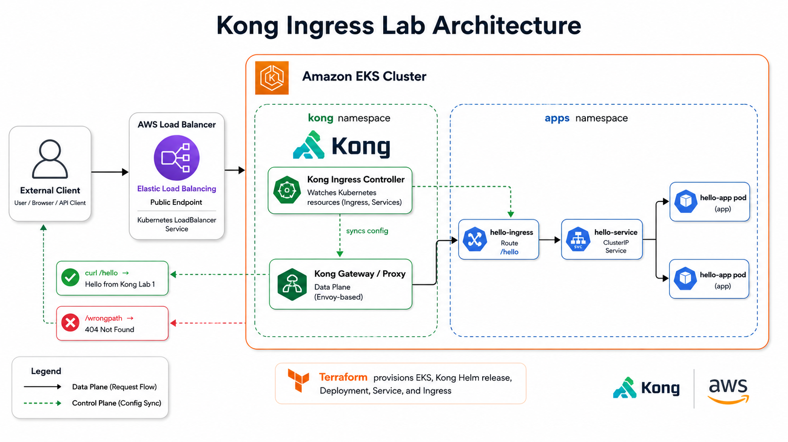

### This is a placeholder until I can create a custom diagram

---

## 📹 **Project Demos**

- <https://github.com/user-attachments/assets/1037117a-056d-4a09-8031-88261c92d3c0>
- <https://github.com/user-attachments/assets/eb2e6b23-e39f-4177-ae2f-7ba8472e9a67>
- <https://github.com/user-attachments/assets/1cc98e8c-1eb6-448a-bed6-3942a0dc932e>

---

## 📖 **Project Overview**

This project introduces **API Gateway architecture in Kubernetes** using Kong.

Instead of exposing Pods directly, all inbound traffic flows through Kong.

### 🔑 **Key Concepts**

| **Component**               | **Purpose**                                    |
| --------------------------- | ---------------------------------------------- |
| Deployment                  | Manages application Pods                       |
| Service                     | Provides stable internal access to Pods        |
| Ingress                     | Defines routing intent                         |
| Kong Ingress Controller     | Watches Kubernetes resources and updates Kong  |
| Kong Gateway                | Enforces routing and receives external traffic |

---

## 🧠 **Engineering Principles Demonstrated**

This lab demonstrates several core DevOps and Platform Engineering principles.

### **Infrastructure as Code**

All core infrastructure and Kubernetes resources are managed through Terraform. This creates a repeatable deployment model and avoids manual configuration drift.

### **Separation of Concerns**

The application, service routing, ingress gateway, and infrastructure layers are separated logically:

- AWS infrastructure layer
- EKS cluster layer
- Kong platform layer
- Application workload layer

### **Gateway-Based Service Exposure**

Pods are not exposed directly. Traffic flows through Kong Gateway, which provides a centralized control point for routing and future security policies.

### **Operational Validation**

The project includes validation commands for:

- Kubernetes resources
- Kong resources
- Ingress behavior
- successful route testing
- failure route testing
- controller log verification

### **Recovery Awareness**

The teardown section documents real-world cleanup problems such as stuck namespaces and lingering AWS Load Balancers. This reflects operational troubleshooting experience beyond a basic lab.

---

## 🧰 **Requirements**

- AWS account
- Terraform v1.10+
- AWS CLI
- kubectl
- Helm
- Git

---

## 💰 **Cost Awareness**

This lab creates real AWS resources and may generate cost if left running.

### **Resources That May Incur Cost**

- EKS cluster
- EKS worker nodes
- NAT Gateway
- AWS Load Balancer
- EBS volumes
- Data transfer
- CloudWatch logs

### **Cost Control Practices**

- Destroy lab resources after validation
- Run `./kong-teardown.sh` before full infrastructure teardown
- Check for leftover Load Balancers
- Check for leftover NAT Gateways
- Check for unattached EBS volumes
- Use AWS Billing alerts for lab accounts

### **Post-Teardown Cost Checks**

```bash
aws elb describe-load-balancers --region us-east-1
aws elbv2 describe-load-balancers --region us-east-1
aws ec2 describe-nat-gateways --region us-east-1
aws ec2 describe-volumes --filters Name=status,Values=available --region us-east-1
```

---

## 📁 **Project Structure**

```text
project-5/
├── artifacts/
|   └── kong.log
|
├── images/
│   ├── deliverable1.jpg
│   ├── deliverable2.jpg
|   ├── deliverable3.jpg
│   ├── deliverable4.jpg
|   ├── deliverable5.jpg
|   ├── deliverable6.jpg
|   ├── deliverable7.jpg
│   ├── diagram.png
│   ├── terraform-apply.jpg
│   ├── terraform-destroy-pt1.jpg
│   ├── terraform-destroy-pt2.jpg
|   ├── terraform-init-fmt-validate.jpg
│   └── terraform-plan.jpg
│
├── manifests/
│   ├── helloapp.yaml
│   ├── helloservice.yaml
│   └── kong_helloingress.yaml
│
├── scripts/
│   └── kong-teardown.sh
│
├── terraform/
│   ├── 0-var.tf
│   ├── 1-auth.tf
│   ├── 2-vpc.tf
│   ├── 3-subnets.tf
│   ├── 4-igw.tf
│   ├── 5-nat.tf
│   ├── 6-rtb.tf
│   ├── 7-eks.tf
│   ├── 8-node.tf
│   ├── 9-runtime.tf
│   ├── 10-iam-oidc.tf
│   ├── 11a-storage-iam.tf
│   ├── 11b-storage-helm.tf
│   ├── 12-k8s-provider.tf
│   ├── 13-kong.tf
│   ├── 14-hello-app.tf
│   └── 15-output.tf
│
└── README.md
```

---

## 🏭 **Production Readiness Matrix**

| **Area**           | **Current Lab Implementation**                                | **Production-Grade Enhancement**                                           |
| ------------------ | ------------------------------------------------------------- | -------------------------------------------------------------------------- |
| **Infrastructure** | Terraform provisions EKS, networking, Kong, and app resources | Split into separate `infra` and `platform` Terraform stacks                |
| **Routing**        | Kong Ingress routes `/hello` to `hello-service`               | Migrate to Gateway API with `Gateway` and `HTTPRoute`                      |
| **Security**       | Basic HTTP routing                                            | Add TLS, OIDC, JWT, rate limiting, and IP restrictions                     |
| **Availability**   | Two `hello-app` replicas                                      | Add HPA, PodDisruptionBudgets, readiness/liveness probes                   |
| **Observability**  | `kubectl logs` and resource inspection                        | Add Prometheus, Grafana, Loki, CloudWatch Container Insights, and alerting |
| **Delivery**       | Manual Terraform apply                                        | Add CI/CD pipeline with Terraform plan review and approval gates           |
| **Validation**     | Manual `kubectl` and `curl` tests                             | Add automated smoke tests                                                  |
| **Teardown**       | Helper script and Terraform destroy                           | Add ordered teardown automation with AWS dependency checks                 |
| **Cost Control**   | Manual destroy after lab                                      | Add cost tags, budgets, and automated cleanup policies                     |

---

## ⚙️ **Deployment Strategy**

This project uses **Terraform as the source of truth**.

### Primary Deployment Method

Terraform manages:

- AWS VPC resources
- EKS cluster
- EKS node group
- Kubernetes provider
- Helm provider
- Kong Helm release
- hello application Deployment
- hello Service
- hello Ingress

### YAML Manifests

The YAML files in `manifests/` are kept as **reference artifacts only**.

Do **not** deploy them with:

```bash
kubectl apply -f manifests/
```

when Terraform is managing the same resources.

---

## 🚀 **Deploy the Lab**

```bash
terraform init
terraform fmt -recursive
terraform validate
terraform plan
terraform apply
```

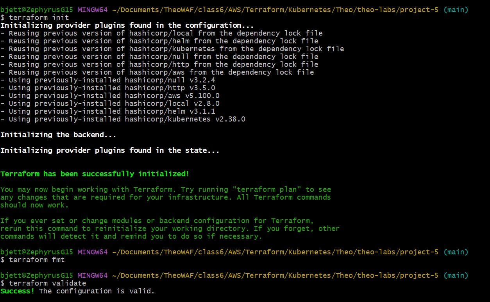
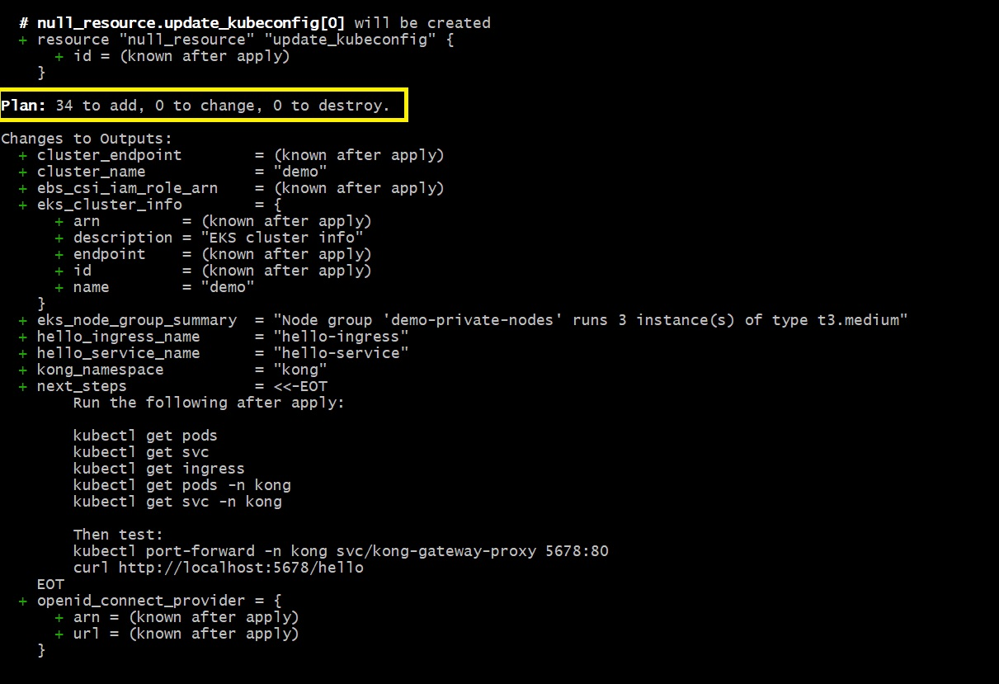
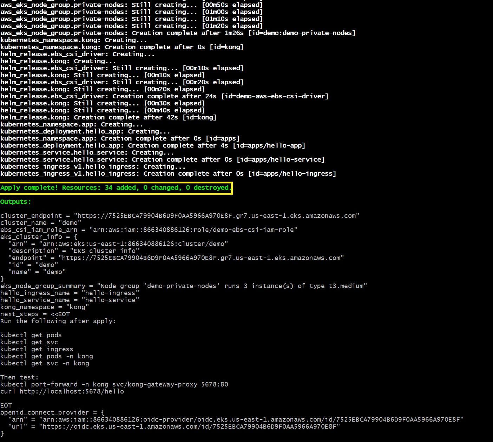

### 📝 **Terraform Output**

```bash
aws eks update-kubeconfig \
  --region us-east-1 \
  --name $(terraform output -raw cluster_name)
```

---

## 🧪 **Validation & Testing**

### **Verify Cluster**

```bash
kubectl get pods -A
```

### **Verify Application Resources**

Your application is deployed in the `apps` namespace.

```bash
kubectl get pods -n apps
kubectl get svc -n apps
kubectl get ingress -n apps
kubectl describe ingress hello-ingress -n apps
```

### **Verify Kong Resources**

```bash
kubectl get pods -n kong
kubectl get svc -n kong
```

---

## 🌐 **Test the Application**

### **Get Kong Address**

```bash
kubectl get svc -n kong kong-gateway-proxy
```

### **Test Success Route**

```bash
curl http://localhost:5678/hello
```

### **Test Failure Route**

```bash
curl http://localhost:5678/wrongpath
```

---

## 🌐 **Localhost Testing**

To test through localhost instead of the AWS DNS name, run:

```bash
kubectl port-forward -n kong svc/kong-gateway-proxy 5678:80
```

Keep that terminal open.

In a web browser and test:

```text
http://localhost:5678/hello
http://localhost:5678/wrongpath
```

- 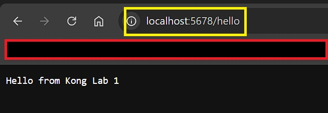
- 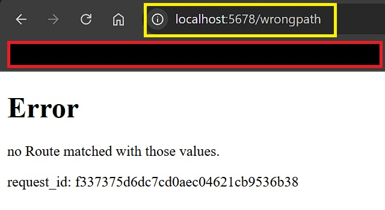

---

## 🔍 **Controller Log Validation**

Get the Kong controller logs:

```bash
kubectl logs -n kong $(kubectl get pods -n kong -o name | grep controller | head -n 1)
```

This proves Kong Ingress Controller detected Kubernetes resources and synced configuration into Kong Gateway.

---

## 🧠 **Lab Questions & Answers**

### What is the controller pod?

The controller pod is the Kong Ingress Controller. It watches Kubernetes resources such as Ingress, Service, and EndpointSlice, then updates Kong Gateway configuration.

### What is the proxy Service?

The proxy Service is the external entry point for client traffic.

### What is namespace separation?

Namespace separation keeps workloads organized:

| **Namespace**     | **Purpose**                      |
| ----------------- | -------------------------------- |
| `apps`            | hello application                |
| `kong`            | Kong controller and gateway      |
| `kube-system`     | Kubernetes/EKS system components |

### Where is the application actually running?

The application runs in Pods managed by the `hello-app` Deployment in the `apps` namespace.

### What object exposes the Pods internally?

The Kubernetes Service named `hello-service`.

### What object tells Kong how to route traffic?

The Ingress resource named `hello-ingress`.

### What happens if I request `/hello`?

Kong matches the `/hello` route and forwards traffic to `hello-service`, which forwards traffic to the `hello-app` Pods.

### What happens if I request `/wrongpath`?

Kong does not find a matching route and returns `404 Not Found`.

---

## 🧪 **Failure Scenarios**

### **Failure A — Wrong Service Name**

Change the backend Service name from:

```yaml
name: hello-service
```

to:

```yaml
name: hello-servicex
```

Expected result:

- Kong cannot route traffic to the backend
- Request may return `404` or `503`

### **Failure B — Wrong Target Port**

Change:

```yaml
targetPort: 5678
```

to:

```yaml
targetPort: 9999
```

Expected result:

- Service cannot reach the application container
- Request fails at the upstream/backend level

### **Failure C — Wrong Path Behavior**

Remove or modify:

```yaml
konghq.com/strip-path: "true"
```

Expected result:

- Backend may receive `/hello` instead of `/`
- Response behavior may change depending on app logic

---

## 🌍 **Real-World Value**

Kong provides:

- centralized routing
- API governance
- authentication and authorization extension points
- rate limiting
- observability hooks
- secure service exposure

---

## 🔐 **Security Architecture**

### **Current Lab State**

- Basic routing enabled
- No authentication
- No rate limiting
- No TLS termination configured manually

### **Production Enhancements**

Recommended future improvements:

- TLS/HTTPS
- JWT authentication
- OIDC integration
- rate limiting
- IP restriction
- request/response logging
- WAF in front of Kong
- mTLS between services

---

## 📊 **Observability & Monitoring**

### **Current Validation**

```bash
kubectl get pods -A
kubectl logs -n kong <kong-controller-pod>
kubectl describe ingress hello-ingress -n apps
```

### **Production Stack**

Recommended tools:

- Prometheus
- Grafana
- CloudWatch Container Insights
- Headlamp

### **Metrics to Track**

- request latency
- 4xx errors
- 5xx errors
- upstream health
- request volume
- gateway availability

---

## ⚖️ **Scaling & Performance Considerations**

### **Current Lab**

- two `hello-app` replicas
- Kong Gateway handles inbound traffic
- Kubernetes Service balances traffic across Pods

### **Production Improvements**

- Horizontal Pod Autoscaler
- Kong autoscaling
- multi-AZ node groups
- readiness/liveness probes
- PodDisruptionBudgets
- resource requests and limits
- external DNS
- TLS certificates

---

## 🧩 **Multi-Service Expansion**

Future routes:

```text
Kong Gateway
  ├── /hello   → hello-service
  ├── /weather → weather-service
  └── /status  → status-service
```

This lab can be expanded to demonstrate multi-service API gateway routing.

---

## 📸 **Artifacts**

Capture these for submission:

```bash
kubectl get pods -A
kubectl get pods -n apps
kubectl get svc -n apps
kubectl get ingress -n apps
kubectl describe ingress hello-ingress -n apps
kubectl get pods -n kong
kubectl get svc -n kong
kubectl get svc -n kong kong-gateway-proxy
curl http://localhost:5678/hello
curl http://localhost:5678/wrongpath
```

Recommended screenshot list:

| **Artifact**            | **Description**                                                                                                                                                                                                                                               | **Screenshot Filename**                            |
| ----------------------- | ------------------------------------------------------------------------------------------------------------------------------------------------------------------------------------------------------------------------------------------------------------- | --------------------------------------------       |
| All Pods                | `kubectl get pods -A` exist                                                                                                                                                                                                                                   | 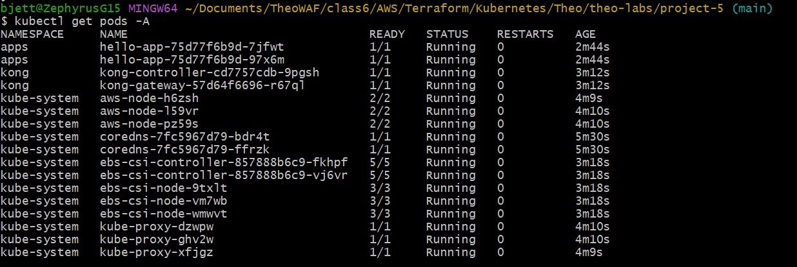       |
| Application Validation  | App Pods verified with `kubectl get pods -n apps`<br>Services verified with `kubectl get svc -n apps`<br>Ingress resources verified `kubectl get ingress -n apps`<br>Hello Ingress details verified `kubectl describe ingress hello-ingress -n apps`          | 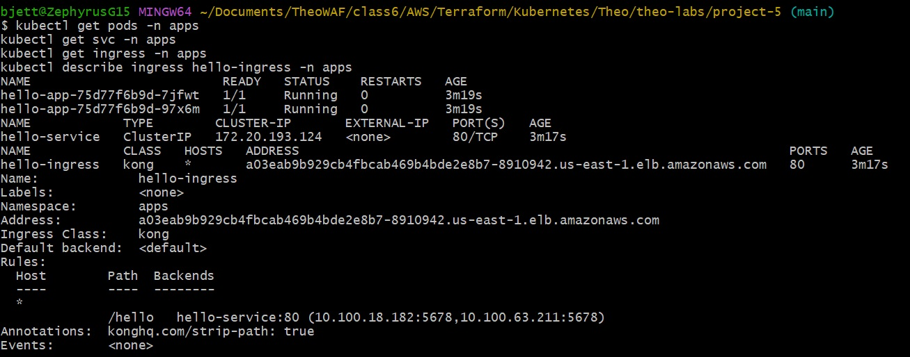       |
| Kong Pods               | `kubectl get pods -n kong` exist                                                                                                                                                                                                                              | 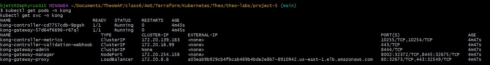       |
| Kong Service Validation | `kubectl get svc -n kong kong-gateway-proxy` service exists endpoint                                                                                                                                                                                          | 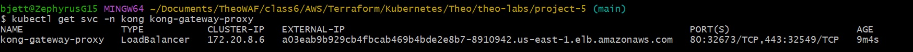       |
| Curl Route Validation   | Successful route verified with `curl http://localhost:5678/hello`<br>Failure route verified with `curl http://localhost:5678/wrongpath`<br>Confirms Kong correctly routes valid paths and rejects unmatched paths                                             | 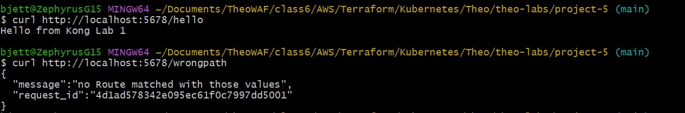       |
| Logs                    | Kong successfully synced configuration                                                                                                                                                                                                                        | [**kong.log**](artifacts/kong.log)                 |

---

## 🧹 **Teardown**

### Preferred Terraform Teardown

`kong-teardown.sh` is a helper script to clean up Kong resources before destroying the cluster. This will prevent Terraform from hanging on namespace deletion due to finalizers.

```bash
./kong-teardown.sh
```

After the script completes, confirm that AWS Load Balancers, NAT Gateways, and unattached EBS volumes are removed using the post-teardown cost checks above.

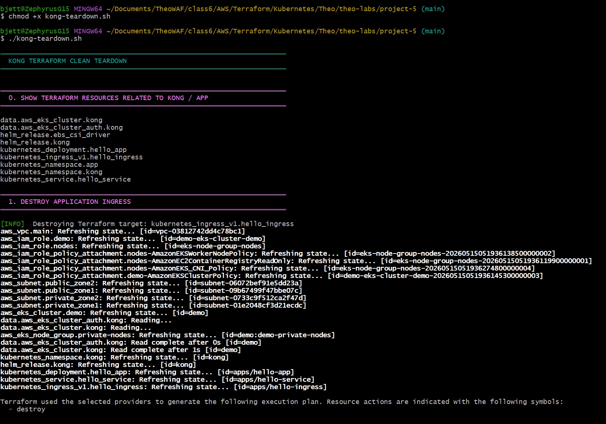
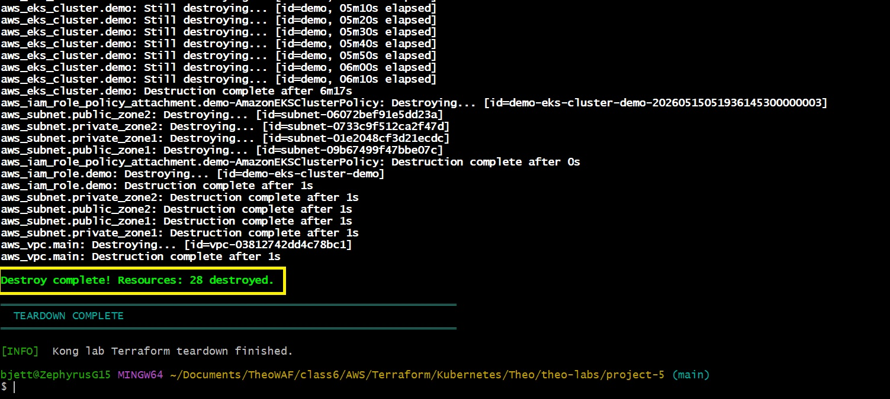

---

## 🧪 **Troubleshooting**

### App is not visible in default namespace

This is expected if Terraform deploys the app to `apps`.

Use:

```bash
kubectl get pods -n apps
```

or:

```bash
kubectl get pods -A
```

### Kong DNS works but localhost does not

Start port-forwarding:

```bash
kubectl port-forward -n kong svc/kong-gateway-proxy 5678:80
```

Then test:

```bash
curl http://localhost:5678/hello
```

### Kong address is pending

Wait a few minutes:

```bash
kubectl get svc -n kong kong-gateway-proxy
```

AWS may take time to provision the LoadBalancer.

### Deprecated Kong CRD warnings

Check whether deprecated resources are actually used:

```bash
kubectl get kongingress,tcpingress,udpingress -A
```

If the result is:

```text
No resources found
```

then the warnings are benign for this lab.

### Terraform destroy stuck on namespace

Check namespaces:

```bash
kubectl get ns
```

If stuck in `Terminating`, inspect resources:

```bash
kubectl get all -n apps
kubectl get all -n kong
```

Force finalizers only as a recovery step.

---

## 📚 **References**

The following documentation was used to design, deploy, validate, and troubleshoot this Kong Ingress lab.

### 🦍 **Kong Documentation**

- [**Kong Ingress Controller Documentation**](https://developer.konghq.com/kubernetes-ingress-controller/)  
- [**Kong Ingress Controller – Install KIC**](https://developer.konghq.com/kubernetes-ingress-controller/install/)  
- [**Kong Ingress Controller – Annotation Reference**](https://developer.konghq.com/kubernetes-ingress-controller/reference/annotations/)
- [**Kong Ingress Controller – Gateway API**](https://developer.konghq.com/kubernetes-ingress-controller/gateway-api/)  
- [**Kong Ingress Controller – Routing with Ingress**](https://developer.konghq.com/kubernetes-ingress-controller/routing/)  
- [**Kong Ingress Controller – Reference**](https://developer.konghq.com/kubernetes-ingress-controller/reference/)  
- [**Kong Gateway Documentation**](https://developer.konghq.com/gateway/)  
- [**Kong Gateway DB-less Mode**](https://developer.konghq.com/gateway/db-less-mode/)  
- [**Kong Ingress Controller Upgrade Guidance**](https://developer.konghq.com/kubernetes-ingress-controller/faq/upgrading-ingress-controller/)  

---

### ☸️ **Kubernetes Documentation**

- [**Kubernetes Documentation**](https://kubernetes.io/docs/)  
- [**Kubernetes Deployments**](https://kubernetes.io/docs/concepts/workloads/controllers/deployment/)  
- [**Kubernetes Pods**](https://kubernetes.io/docs/concepts/workloads/pods/)  
- [**Kubernetes Services**](https://kubernetes.io/docs/concepts/services-networking/service/)  
- [**Kubernetes Ingress**](https://kubernetes.io/docs/concepts/services-networking/ingress/)  
- [**Kubernetes Ingress Controllers**](https://kubernetes.io/docs/concepts/services-networking/ingress-controllers/)  
- [**Kubernetes Namespaces**](https://kubernetes.io/docs/concepts/overview/working-with-objects/namespaces/)  
- [**Kubernetes Labels and Selectors**](https://kubernetes.io/docs/concepts/overview/working-with-objects/labels/)  
- [**Kubernetes Resource Management for Pods and Containers**](https://kubernetes.io/docs/concepts/configuration/manage-resources-containers/)  
- [**Kubernetes Debug Services**](https://kubernetes.io/docs/tasks/debug/debug-application/debug-service/)  
- [**Kubernetes Logging Architecture**](https://kubernetes.io/docs/concepts/cluster-administration/logging/)  
- [**Kubernetes Gateway API**](https://kubernetes.io/docs/concepts/services-networking/gateway/)  

### 🌉 **Gateway API Documentation**

- [**Gateway API Official Documentation**](https://gateway-api.sigs.k8s.io/)  
- [**Gateway API Concepts**](https://gateway-api.sigs.k8s.io/concepts/api-overview/)  
- [**Gateway API Standard Channel Reference**](https://gateway-api.sigs.k8s.io/references/spec/)  
- [**Gateway API GitHub Repository**](https://github.com/kubernetes-sigs/gateway-api)  

### 📦 **Helm Documentation**

- [**Helm Documentation**](https://helm.sh/docs/)  
- [**Using Helm**](https://helm.sh/docs/intro/using_helm/)  
- [**Helm Install Command**](https://helm.sh/docs/helm/helm_install/)  
- [**Helm Upgrade Command**](https://helm.sh/docs/helm/helm_upgrade/)  
- [**Helm Uninstall Command**](https://helm.sh/docs/helm/helm_uninstall/)  
- [**Helm Charts**](https://helm.sh/docs/topics/charts/)  
- [**Helm Repositories**](https://helm.sh/docs/topics/chart_repository/)  

### 🏗️ **Terraform Documentation**

- [**Terraform Documentation**](https://developer.hashicorp.com/terraform/docs)  
- [**Terraform Providers**](https://developer.hashicorp.com/terraform/language/providers)  
- [**Terraform State**](https://developer.hashicorp.com/terraform/language/state)  
- [**Terraform Backend Configuration**](https://developer.hashicorp.com/terraform/language/backend)  
- [**Terraform CLI – init**](https://developer.hashicorp.com/terraform/cli/commands/init)  
- [**Terraform CLI – fmt**](https://developer.hashicorp.com/terraform/cli/commands/fmt)  
- [**Terraform CLI – validate**](https://developer.hashicorp.com/terraform/cli/commands/validate)  
- [**Terraform CLI – plan**](https://developer.hashicorp.com/terraform/cli/commands/plan)  
- [**Terraform CLI – apply**](https://developer.hashicorp.com/terraform/cli/commands/apply)  
- [**Terraform CLI – destroy**](https://developer.hashicorp.com/terraform/cli/commands/destroy)  
- [**Terraform AWS Provider**](https://registry.terraform.io/providers/hashicorp/aws/latest/docs)  
- [**Terraform Kubernetes Provider**](https://registry.terraform.io/providers/hashicorp/kubernetes/latest/docs)  
- [**Terraform Helm Provider**](https://registry.terraform.io/providers/hashicorp/helm/latest/docs)  
- [**Terraform Helm Provider Tutorial**](https://developer.hashicorp.com/terraform/tutorials/kubernetes/helm-provider)  

### ☁️ **AWS / Amazon EKS Documentation**

- [**Amazon EKS Documentation**](https://docs.aws.amazon.com/eks/)  
- [**Amazon EKS User Guide**](https://docs.aws.amazon.com/eks/latest/userguide/what-is-eks.html)  
- [**Create an Amazon EKS Cluster**](https://docs.aws.amazon.com/eks/latest/userguide/create-cluster.html)  
- [**Amazon EKS Managed Node Groups**](https://docs.aws.amazon.com/eks/latest/userguide/managed-node-groups.html)  
- [**Amazon EKS Networking**](https://docs.aws.amazon.com/eks/latest/userguide/network-reqs.html)  
- [**Amazon VPC Documentation**](https://docs.aws.amazon.com/vpc/)  
- [**Elastic Load Balancing Documentation**](https://docs.aws.amazon.com/elasticloadbalancing/)  
- [**Classic Load Balancer Documentation**](https://docs.aws.amazon.com/elasticloadbalancing/latest/classic/introduction.html)  
- [**AWS CLI EKS update-kubeconfig**](https://docs.aws.amazon.com/cli/latest/reference/eks/update-kubeconfig.html)  
- [**AWS CLI ELB Commands**](https://docs.aws.amazon.com/cli/latest/reference/elb/)  
- [**AWS CLI ELBv2 Commands**](https://docs.aws.amazon.com/cli/latest/reference/elbv2/)  
- [**AWS CLI EC2 Network Interface Commands**](https://docs.aws.amazon.com/cli/latest/reference/ec2/describe-network-interfaces.html)  
- [**AWS CLI EC2 NAT Gateway Commands**](https://docs.aws.amazon.com/cli/latest/reference/ec2/describe-nat-gateways.html)  

### 🧪 **Validation and Troubleshooting References**

- [**kubectl Cheat Sheet**](https://kubernetes.io/docs/reference/kubectl/cheatsheet/)  
- [**kubectl Logs**](https://kubernetes.io/docs/reference/kubectl/generated/kubectl_logs/)  
- [**kubectl Describe**](https://kubernetes.io/docs/reference/kubectl/generated/kubectl_describe/)  
- [**kubectl Port Forward**](https://kubernetes.io/docs/reference/kubectl/generated/kubectl_port-forward/)  
- [**Kubernetes Finalizers**](https://kubernetes.io/docs/concepts/overview/working-with-objects/finalizers/)  
- [**Kubernetes Debugging Applications**](https://kubernetes.io/docs/tasks/debug/debug-application/)  

### 🧾 **Class / Project References**

- **BalericaAI Kubernetes Class – Project 5 Kong YAML Examples**  
  Used as the original lab reference for the `hello-app`, `hello-service`, and `hello-ingress` YAML manifests.

  - [**Hello App (YAML)**](https://github.com/BalericaAI/kubernetesclass/blob/main/Project5_Kong/yaml/helloapp.yaml)
  - [**Hello Service (YAML)**](https://github.com/BalericaAI/kubernetesclass/blob/main/Project5_Kong/yaml/helloservice.yaml)
  - [**Kong Hello Ingress (YAML)**](https://github.com/BalericaAI/kubernetesclass/blob/main/Project5_Kong/yaml/kong_helloingress.yaml)

---

### 🧠 **How These References Were Used**

These references were used to support the following project tasks:

| **Documentation Area**      | **How It Was Used**                                                                              |
| --------------------------- | ------------------------------------------------------------------------------------------------ |
| **Kong Ingress Controller** | Understand how Kong watches Kubernetes resources and configures Kong Gateway                     |
| **Kubernetes Deployment**   | Define and validate the `hello-app` Pods                                                         |
| **Kubernetes Service**      | Define the `hello-service` Service and expose the application internally through `hello-service` |
| **Kubernetes Ingress**      | Define the `/hello` route into the application                                                   |
| **Helm**                    | Install Kong into the `kong` namespace                                                           |
| **Terraform**               | Automate AWS, EKS, Kong, and Kubernetes resource deployment                                      |
| **AWS EKS**                 | Provision and operate the Kubernetes control plane and worker nodes                              |
| **AWS ELB / ELBv2**         | Troubleshoot LoadBalancer resources created by Kong                                              |
| **Gateway API**             | Document a future migration path from Ingress to `Gateway` and `HTTPRoute`                       |
| **kubectl**                 | Validate resources, inspect logs, and troubleshoot routing                                       |
| **AWS CLI**                 | Update kubeconfig and troubleshoot AWS networking dependencies                                   |

---

## 👥 **Author**

| **Field**    | **Value**                                  |
| ------------ | ------------------------------------------ |
| Author       | `T.I.Q.S.`                                 |
| Group Leader | `John Sweeney`                             |
| Group Name   | `The Brotherhood of jerMutants - Wolfpack` |
| Version      | `v1.0`                                     |
| Date         | `May 15, 2026`                             |

---

## 🏁 **Final Summary**

This lab demonstrates how Kong can act as a centralized API Gateway for Kubernetes workloads running on Amazon EKS.

The project proves that:

- Terraform can provision both AWS infrastructure and Kubernetes resources
- Kong can expose Kubernetes applications through controlled Ingress routing
- Services provide stable internal access to Pods
- Clients do not communicate directly with Pods
- Operational validation is required to confirm routing, logging, and failure behavior

### Core Principle

> Never expose Pods directly — route traffic through a controlled gateway layer.
